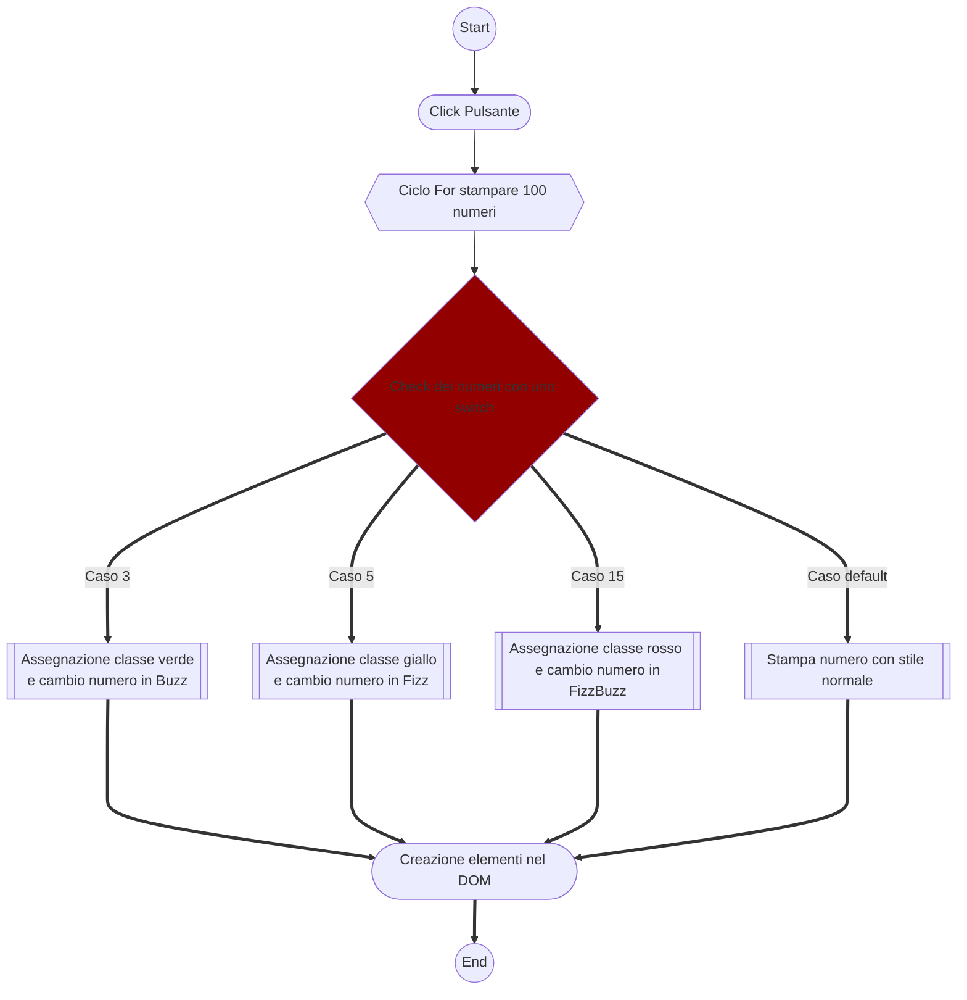

# js-fizzbuzzdom

Consegna:
Scrivi un programma che stampi in console i numeri da 1 a 100.
# MILESTONE 1
Per i multipli di 3 stampi “Fizz” al posto del numero e per i multipli di 5 stampi Buzz.
Per i numeri che sono sia multipli di 3 che di 5 stampi FizzBuzz.
# MILESTONE 2 (Bonus)
Dato un container nel DOM, appendi un elemento html con il numero o la stringa corretta.

# MILESTONE 3 ( superbonus )
Applica uno stile differente a seconda del valore dell'indice per i multipli di 3, per i multipli di 5 e per i valori che sono sia multipli di 3 che di 5.

